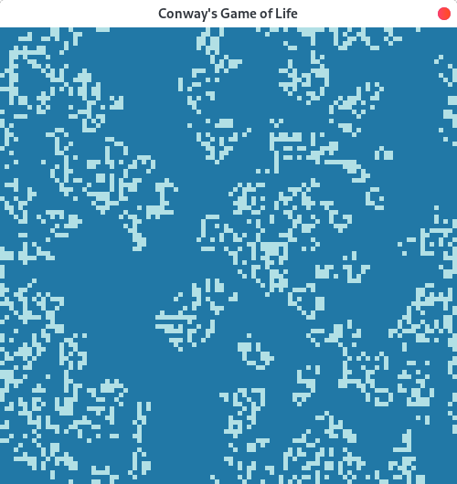
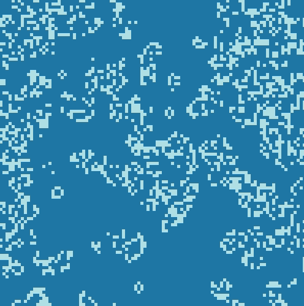

# Go! Conway's Game
A simple Conway's game of life implementation with golang and OpenGL following [this tutorial](https://kylewbanks.com/blog/tutorial-opengl-with-golang-part-1-hello-opengl)

## Build
Simply run 
```bash
go build -o ConwaysGame
```

## Demo


